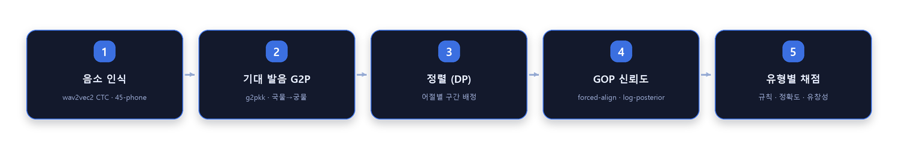

<p align="center">
  
</p>

<div align="center">

# 📖 한국어 난독증 읽기평가 엔진

**아동이 소리 내어 읽은 음성을 정답 발음과 비교해 읽기 정확도를 자동 채점하고, 오류를 임상 유형으로 분류해 중재 방향까지 처방하는 채점 엔진**


</div>

> **🔒 데이터 거버넌스** — 실제 아동 음성, 임상 사례 자료, 표준화 검사 문항은 이 저장소에 포함되지 않습니다.
> 검사 문항(`task_db.py`)은 **검사 보안을 위해 목업 문항으로 교체**했고, 임상 확장 레이어의 근거가 된
> 사례연구는 **완전히 익명화**해 참조합니다. 테스트 음성은 `make_dummy_wav.py`로 생성하거나 직접 녹음합니다.

---

## 1. 핵심 아이디어: 전사가 아니라 "정답 대비 정합성"

아동은 **정해진** 단어/문장을 읽습니다. 그래서 이 문제는 open transcription이 아니라
*"목표 발음 대비 얼마나 정확히 산출했는가"* 측정 문제입니다.

- **Whisper를 쓰지 않습니다** — 디코더 언어모델이 오독을 조용히 "교정"해 버려서
  진단 신호(오류)가 사라집니다. 이것이 이 시스템의 핵심 설계 원칙입니다
- 대신 **wav2vec2 음소-CTC** (`slplab/wav2vec2-xls-r-300m_phone-mfa_korean`)로
  음소열을 그대로 인식하고, **g2pkk**로 만든 정답 발음열과 DP 정렬로 비교합니다
- 파인튜닝 없음 — 사전학습 모델 추론 + 규칙 코드만으로 구성 (데이터가 없는 상황에서 출발)

<p align="center">
  
</p>

## 2. 두 개의 레이어

### 채점 엔진 (v0)
| 과제 | 인식 방식 | 채점 |
|---|---|---|
| ① 낱말읽기 (의미40+무의미40) | 열린 음소 전사 → DP 정렬 | 자모 diff + 유형별 엄격도 (무의미 최엄격) |
| ② 단락읽기 | 같은 음향모델 재사용 → 어절 정렬 | 어절 정확도 + 읽기 속도(유창성) |
| ③ 음운인식(합성) | 닫힌집합 forced-align 우도 | 후보 선택 + GOP 오발음 게이트 |

문항 유형별 차등 엄격도: `transparent`(표기=발음, 조음 미숙 관대) / `phonrule`(음운규칙 적용 실패도
오류) / `nonword`(맥락 추측 불가, 최엄격).

### 임상 확장 레이어
익명화된 난독증 치료 사례연구(152회기 종단 기록)를 근거로, 점수만 내는 채점기를
**"오류의 질을 읽는" 진단 도구**로 확장:

- `error_taxonomy.py` — 조음·음운 자질표 기반 **14개 임상 오류 유형** 자동 분류 (초성 생략, 음절 도치, 치찰음 혼동, 활음 단순화 …)
- `skill_map.py` — 음운인식→해독→쓰기 **27노드 발달 위계 DAG**: 약점 스킬을 발달 단계에 배치하고 전제 스킬부터 중재 처방
- `learner_profile.py` — 회기 결과를 JSON으로 누적, 스킬 숙달도·오류 빈도·유창성 추이 종단 추적
- `diagnose.py` — 채점 → 오류 프로파일 → 배치 → 처방 리포트 오케스트레이션

자세한 설계는 [TECHNICAL.md](TECHNICAL.md) (엔진), [CLINICAL_UPGRADE.md](CLINICAL_UPGRADE.md) (임상 레이어) 참고.

## 3. 빠른 시작

```bash
pip install -r requirements.txt

python run_tasks.py selftest      # 모델 없이 채점 로직 검증 (3과제, 수초)
python run_tasks.py info          # 문항 DB 요약
python -m pytest tests/ -q       # 로직 테스트 29개

python make_dummy_wav.py          # 테스트용 합성 wav 생성
python webapp.py                  # Gradio 웹 UI (첫 실행 시 음소 모델 ~1.2GB 다운로드)
python clinical_app.py            # 임상 진단 데모 (모델 불필요 — 텍스트 입력만으로 체험)
```

마이크로 직접 테스트:
```bash
python record_tasks.py --list-devices
python record_tasks.py words --section nonsense   # 무의미 낱말 읽고 채점
python record_tasks.py para                        # 단락 읽고 채점
```

## 4. 코드 맵

| 파일 | 역할 |
|---|---|
| `phoneme_asr.py` / `asr.py` | 음소 CTC / 음절 CTC 인식 (두 트랙, 음소 트랙 권장) |
| `g2p_expected.py` / `phoneme_map.py` | 정답 철자→발음 변환, 한글↔음소 매핑 |
| `align.py` | 자모/음소 분해 + diff·DP 구간 정렬 (대치/탈락/첨가) |
| `scoring.py` | 문항 유형별 엄격도 규칙 채점 (핵심 비즈니스 로직) |
| `gop.py` | GOP(Goodness of Pronunciation) — CTC 사후확률 기반 발음 신뢰도 |
| `fluency.py` | 읽기 속도 (음절/분) |
| `pipeline*.py` | 단어/목록/음소/문장 4개 파이프라인 오케스트레이터 |
| `task_db.py` | 3과제 문항 DB (**목업 문항** — 구조·타입 규칙은 원본과 동일) |
| `error_taxonomy.py` · `skill_map.py` · `learner_profile.py` · `diagnose.py` | 임상 확장 레이어 |
| `phon_awareness.py` / `pa_synth.py` | 음운인식 과제 (글자 없이 소리 조작) |
| `webapp.py` / `app_tasks.py` / `clinical_app.py` | Gradio UI 3종 (실음성 / 3과제 러너 / 임상 데모) |
| `tests/` | 채점·오류분류 회귀 테스트 29개 (모델 불필요) |

## 5. 한계와 정직한 선

이 도구는 **채점 엔진**입니다. 실제 난독증 진단에는 또래 규준, 표준화된 음운처리 검사,
임상가의 판단이 반드시 필요합니다. 임상 레이어의 분류·처방은 단일 사례연구 기반의
설계 예시이며, 일반화에는 다기관 데이터 검증이 필요합니다.

---

<sub>이 저장소는 포트폴리오 열람용입니다. 실무 프로젝트에서 실제 음성·검사 문항·사례 자료를
제거하고 목업 문항과 익명화된 참조로 재구성했습니다.</sub>

---

<!-- portfolio-footer -->

### 🗂️ 포트폴리오

이 저장소는 포트폴리오의 일부입니다. → **[전체 프로젝트 보기](https://github.com/sungjin-ahn-dev)**

- [MOCO — AI Coworker Platform](https://github.com/sungjin-ahn-dev/moco-ai-coworker)
- [근감소증 예측 멀티모달 ML](https://github.com/sungjin-ahn-dev/sarcopenia-multimodal-ml)
- [DTx 인지훈련 난이도 조정 봇](https://github.com/sungjin-ahn-dev/dtx-adaptive-training-bot)
- **한국어 난독증 읽기평가 엔진** ← 현재 저장소
- [AICC 음성 상담 서버](https://github.com/sungjin-ahn-dev/aicc-voice-agent)
